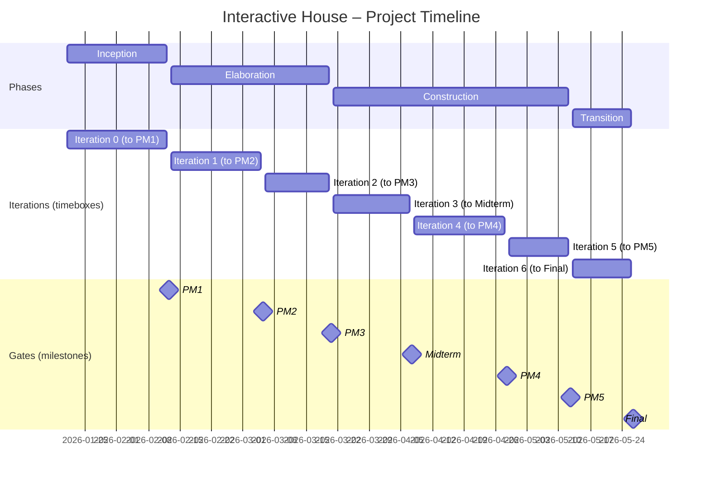

# Interactive House

Course project (DA330B, VT26): an Interactive/Smart House system with **Devices (simulation)**, a **Server + Database (DB)**, and **Units (clients)** (e.g., mobile + computer).  

> This README is intentionally short for now. We’ll expand it as the project evolves.

## Repository structure (initial)
Planned high-level layout (may change):
- `apps/` — Units (mobile/web)
- `services/` — Server/API + DB assets (migrations, seeds, etc.)
- `devices/` — Device simulation(s)
- `shared/` — Shared contracts/utilities (API DTOs, schemas, etc.)
- `docs/` — Project documentation

The Free group can create a separate folder depending on what we choose to build in the “free” part (e.g., voice-to-action, more simulated devices, etc.). If it fits better, they can also place their work inside an existing folder (e.g., `apps/`).

## Project board
We use **GitHub Projects** for planning and tracking:
- Items are tagged with **Area**, **Iteration**, **Work type**, and **Priority**.
- The person doing the work should **self-assign** the issue when starting.

## How we work
- Work happens in **branches** and gets merged via **Pull Requests** into `main`.
- Minimum **1 review** is required before merge.
- See **[CONTRIBUTING.md](CONTRIBUTING.md)** for the step-by-step workflow.

## Timeline (May change)

